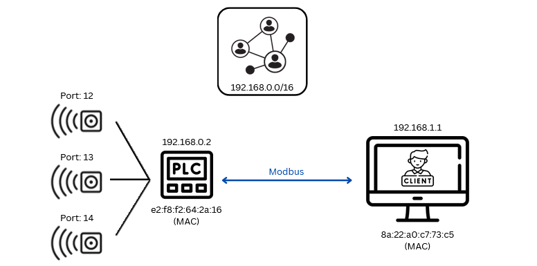
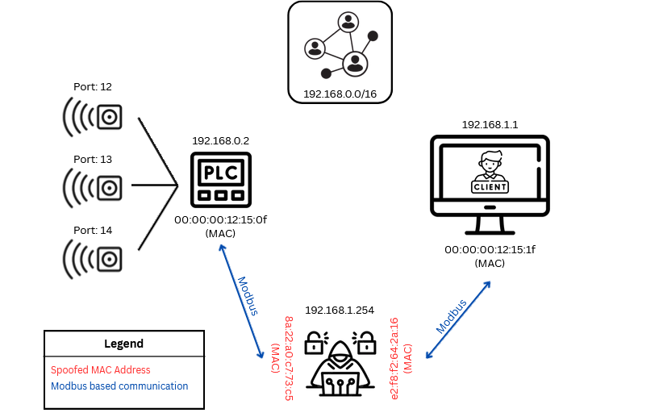

# Current Progress and Future Goals

## Current Progress

- **System Design**: The architecture for the PLC emulation and cyberattack simulation is complete.
- **Docker Setup**: Docker containers for OPC UA, Modbus, and Siemens S7 protocols have been created.
- **Cyberattack Simulation**: MITM attack simulations have been implemented and tested successfully. The `mitm.py` file can be expanded to comprise of various levels and types of attacks.
<!-- - **Security Implementation**: Authentication and encryption mechanisms have been configured for secure communication. -->

## Future Goals

- **Advanced Attack Scenarios**: Simulating more complex attacks, such as denial of service (DoS) attacks, worms, etc.
- **Scalability**: Expanding the emulation to simulate larger industrial networks with more devices.
- **Optimization**: Improving system performance by optimizing container configurations and network settings.
- **Implementation**: Implementing the network attacks in real life conditions.

## Types of Cyberattacks that can be performed

### 1. Basic and Common Implementation

- **Setup**: For a legit pair of server and client, communicating with each other.
- Each of the devices have their own sets of MAC Addresses mapped to their respective IP Addresses. (ARP Cache Table)
- The attacker can perform ARP spoofing (ARP Cache table poisoning) and include its own IP Address to the requested MAC Address. The same can be done on both the ends (attacker <-> server and attacker <-> client). It is performed using the `arpspoof` command in the Kali device.
- For a better understanding of the same, check out the attached image.

This is a normal server-client based connection.

This showcases a case in which an attacker has intercepted the communication line and is in the "middle". It is free to explore (sniff and manipulate) the network, and is vulnerable to further attacks.
<!-- * !(query) Can you manually trigger the re-configuration of the MAC Address? -->

- Based on the concept when you use in the **testing** environment (otherwise, OPC UA is a secure protocol which has encryption, authentication and authorization).

### 2. IO-Link based Communication (need to explore this more)

- IO Link is used to connect smart sensors (SS) or IIoT components to the PLC for enabling wireless (sure?) communication.
- The older protocols like Ethernet and Profinet are under use in this case.
-

### 3. Value mismatch between SCADA Representation and Real Life Implementation

- SCADA simply `GETS` the value from the web server where the respective protocols publish them. (`opc.tcp://localhost:4840` for OPC-UA; `502` for Modbus-TCP, etc).
- These values can be modified before they are shown upon the screen, and manipulated commands can be sent from SCADA.
